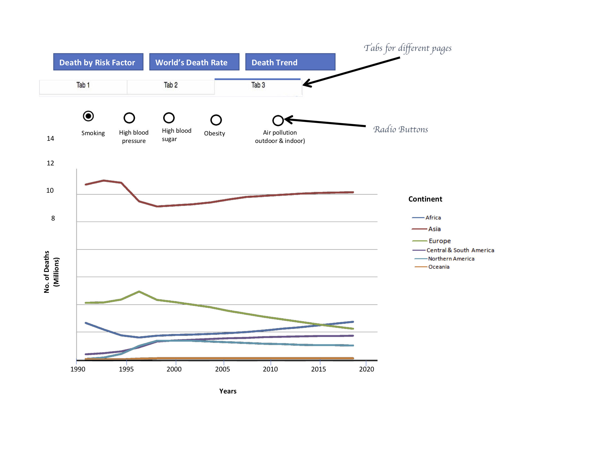

# DSCI_532_Group213_death_by_risk_factors

## App Description

The app contains a page with three toggle buttons. The landing page would display the first toggle button. The first toggle button shows a bar chart, which contains the total number of deaths by different risk factors in 2017. The bars will display horizontally in descending order. If we click on the second toggle button, there is a heat world map that shows the death rates by the top risk factor among different countries in 2017. A tooltip appears with more specific information (country name, the exact death rate by certain risk factor of the country) when the cursor points on different places on the map. There is a drop-down button on the top. From the dropdown list, users can choose a different risk factor (out of the top 5 risk factors of death) to see the death rates of that specific factor across the world. When clicking the third toggle button, there is a line chart that shows the trend of the top risk factor of deaths over the years across continents. The line chart will be colour-coded. There is a radio button that we can click on to choose a different risk factor (out of the top 5 risk factors of death) and see its trend on each continent.

## App Sketch

